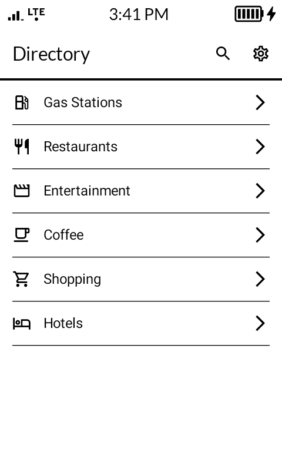
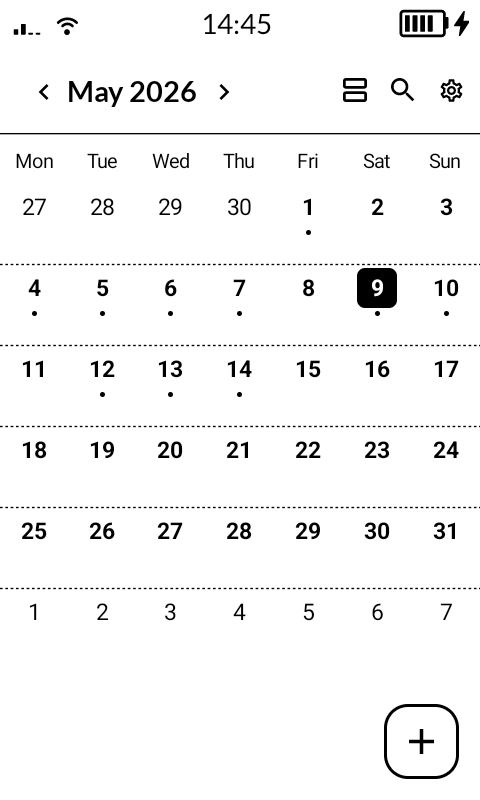
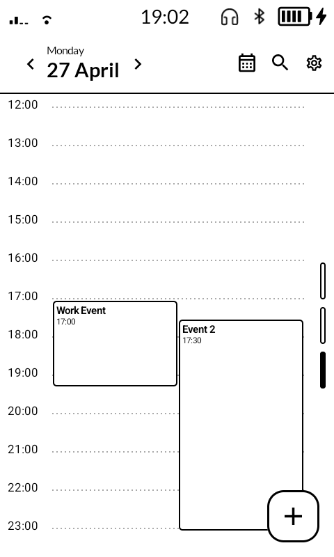
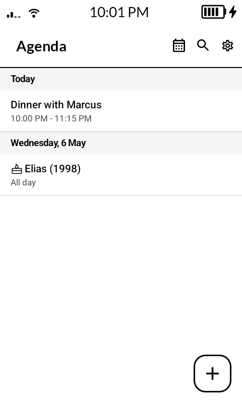
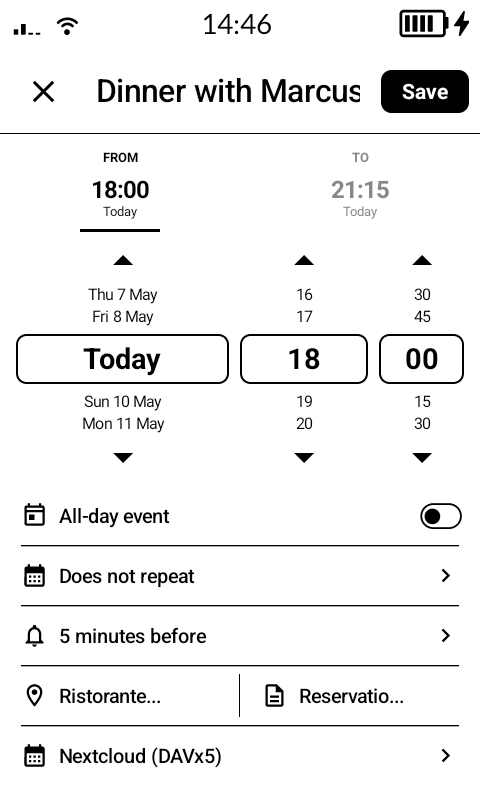

<br clear="all" />

# KompaktCalendar

**KompaktCalendar** is an Android calendar application built with Jetpack Compose, designed and optimized for E-ink displays using the **Mudita Mindful Design (MMD)** library. It is built specifically for the **Mudita Kompakt** but works on any Android device.

Events sync through the standard Android Calendar Provider — no accounts are stored in the app itself. To get your calendars on device, install **DAVx5** (see below).

---

<p float="left">
  
  
  
  
  
  
</p>

---

## Table of Contents

- [Getting Started](#getting-started)
- [Features](#features)
- [Mudita MMD Integration](#mudita-mmd-integration)
- [Technical Stack](#technical-stack)
- [Architecture](#architecture)
- [Acknowledgements](#acknowledgements)
- [License](#license)

---

## Getting Started

### Install DAVx5 (required for calendar sync)

KompaktCalendar reads and writes events through the Android Calendar Provider. It does **not** include its own sync engine. To sync your CalDAV calendars (Nextcloud, Fastmail, Google, iCloud, etc.) you need **DAVx5**:

1. Install [DAVx5](https://www.davx5.com/) from F-Droid or the Play Store.
2. Add your CalDAV account in DAVx5 and enable the calendars you want to sync.
3. Open KompaktCalendar — your calendars will appear automatically.

DAVx5 handles all sync; KompaktCalendar just reads and writes events.

> If you use Google Calendar natively, you can skip DAVx5 — the Google Calendar sync adapter already populates the Android Calendar Provider.

### Build

The project has no Gradle wrapper. Build using Android Studio or a local Gradle installation:

```bash
gradle assembleDebug
adb install app/build/outputs/apk/debug/app-debug.apk
```

---

## Features

- **Month view** — scrollable calendar grid with event indicators, ISO week numbers, and configurable week start day
- **Day view** — 3 switchable time windows (midnight–noon, 8 am–8 pm, noon–midnight) with a live current-time indicator that updates every 30 seconds; supports horizontal scrolling when more than 2 events overlap
- **Agenda view** — upcoming events for the next 3 months, jump-scroll list with e-ink scrollbar
- **Event creation & editing** — title, start/end date+time, all-day toggle, reminder, calendar picker, notes
- **Notifications** — own AlarmManager-based alarm stack; fires a reminder notification N minutes before and a second notification at event start; survives device reboot
- **Full-screen event alert** — at event start time a dedicated full-screen activity launches, waking the screen and bypassing the lock screen so the alert is visible even when the phone is sleeping
- **Search** — full-text search across title, description, and location
- **Settings** — calendar visibility toggles, default calendar, default reminder, week start day, week numbers
- **E-ink optimised** — no animations, jump-based scrolling throughout, high-contrast monochromatic UI

---

## Mudita MMD Integration

The **Mudita Mindful Design (MMD)** library (`com.mudita:MMD:1.0.0`) provides Compose components tuned for E-ink displays:

- **No ripple effects** — instant tap feedback instead of animated ripples that cause ghosting
- **Jump scrolling** — `LazyColumnMMD` scrolls in discrete steps rather than smooth animations
- **E-ink colour scheme** — pure black on white, no gradients
- **Optimised typography** — `TextMMD` with weights and sizes that read well on E-ink

All scrolling in the app uses jump-based mechanics (no animated transitions) to avoid E-ink ghosting.

---

## Technical Stack

| | |
|---|---|
| Language | Kotlin |
| UI | Jetpack Compose |
| Design library | Mudita MMD 1.0.0 |
| Architecture | MVVM with StateFlow |
| Navigation | Jetpack Compose Navigation |
| Calendar data | Android CalendarProvider (ContentProvider) |
| Preferences | Jetpack DataStore |
| Notifications | AlarmManager + BroadcastReceiver |
| Min SDK | 28 (Android 9) |
| Target SDK | 35 (Android 15) |

---

## Architecture

```
┌──────────────────────────────────────┐
│          UI Layer (Compose)          │
│  CalendarScreen  DayViewScreen       │
│  AgendaScreen    AddEventScreen      │
│  EventDetailScreen  SettingsScreen   │
│  EventSearchScreen  NotesScreen      │
└──────────────┬───────────────────────┘
               │ StateFlow / collectAsState
┌──────────────▼───────────────────────┐
│         CalendarViewModel            │
│  Selected date, draft event state,   │
│  permission state, preferences       │
└──────────────┬───────────────────────┘
               │ suspend functions
┌──────────────▼───────────────────────┐
│         CalendarRepository           │
│  Reads/writes Android Calendar       │
│  Provider via ContentResolver        │
│  (CalendarContract.Events,           │
│   Instances, Reminders)              │
└──────────────────────────────────────┘
               │ AlarmManager
┌──────────────▼───────────────────────┐
│   NotificationScheduler              │
│   NotificationReceiver (alarm)       │
│   BootReceiver (reschedule on boot)  │
└──────────────────────────────────────┘
```

There is no local database — all event data lives in the Android Calendar Provider, which DAVx5 (or any other sync adapter) keeps in sync with your server.

---

## Acknowledgements

This project started from **[CalmDirectory](https://github.com/davidraywilson/CalmDirectory)** by [David Ray Wilson](https://github.com/davidraywilson) as a template. The original app structure, Mudita MMD integration patterns, and Compose navigation setup provided a great starting point. The calendar-specific functionality was built on top of that foundation. Thank you!

---

## License

GNU General Public License v3.0 — see [LICENSE](LICENSE) for details.

---

*Built for a calmer, distraction-free experience on the Mudita Kompakt.*
